# CodeRunner

**A high-performance, distributed online judge system for secure code execution and evaluation.**

[](https://openjdk.org/)
[](https://spring.io/projects/spring-boot)
[](https://redis.io/)
[](https://www.docker.com/)

---

## Overview

CodeRunner is a production-ready code execution platform similar to LeetCode, Codeforces, or HackerRank. It provides a scalable architecture for:

- Creating programming problems with custom test cases
- Accepting user code submissions in multiple languages
- Executing code in isolated Docker containers with resource limits
- Evaluating output against expected results using custom judges

---

## System Architecture

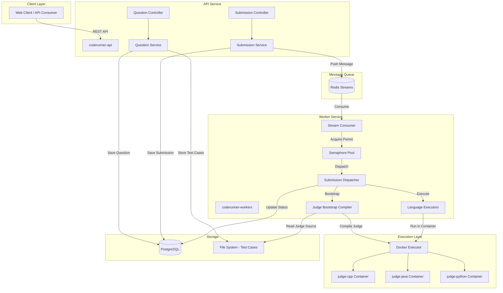

---

## Core Components

### 1. coderunner-api

The REST API gateway that handles all client interactions.

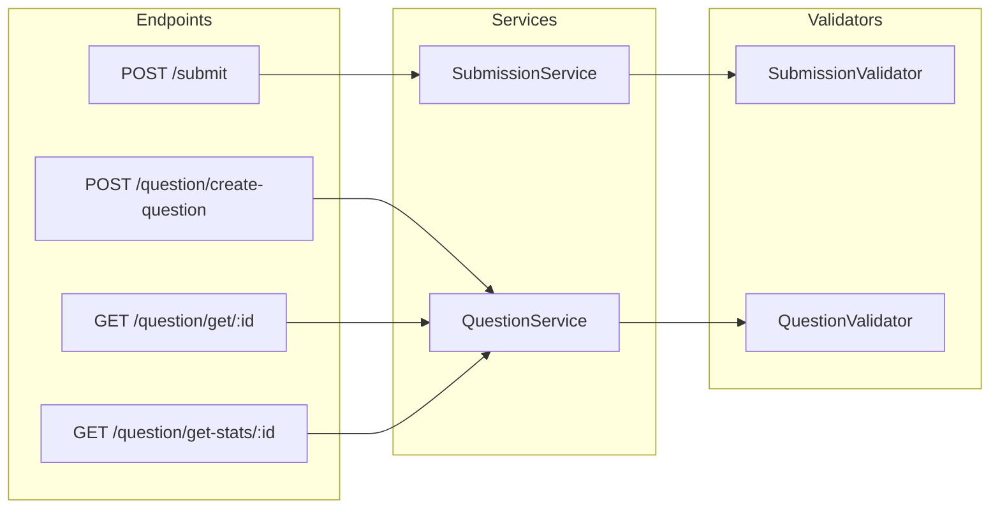

#### API Endpoints

| Method | Endpoint | Description |
|--------|----------|-------------|
| `POST` | `/submit` | Submit code for evaluation |
| `POST` | `/question/create-question` | Create a new programming problem |
| `GET` | `/question/get/{id}` | Retrieve question details |
| `GET` | `/question/get-stats/{id}` | Get submission statistics |

#### Submission Flow

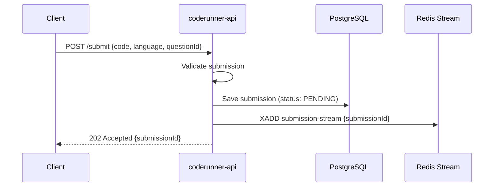

---

### 2. coderunner-workers

The worker service that processes submissions asynchronously with controlled concurrency.

#### Semaphore-Based Concurrency Model

The worker uses a **semaphore-controlled thread pool** to manage concurrent executions efficiently:

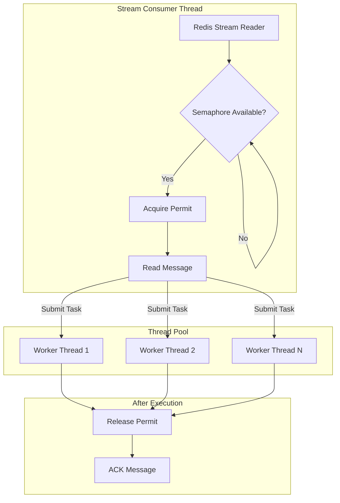

**How it works:**

1. A configurable `Semaphore` with N permits controls max concurrent executions
2. The reader thread **blocks** on `semaphore.acquire()` when all workers are busy
3. Each worker **releases** the permit after completing execution
4. This prevents overwhelming the system while maximizing throughput

```java
// Configuration
@Value("${spring.execution.maximum-thread-count:5}")
private int threadCount;

// Initialization
availableWorkers = new Semaphore(threadCount);
executor = new ThreadPoolExecutor(threadCount, threadCount, ...);

// Read loop
availableWorkers.acquire();  // Blocks if all workers busy
// ... read from stream ...
executor.submit(() -> processSubmission(...));

// After processing
availableWorkers.release();  // Allow next submission
```

---

### 3. Judge Bootstrap Compiler

A **lazy compilation system** that compiles custom judges on-demand with thread-safe concurrency handling.

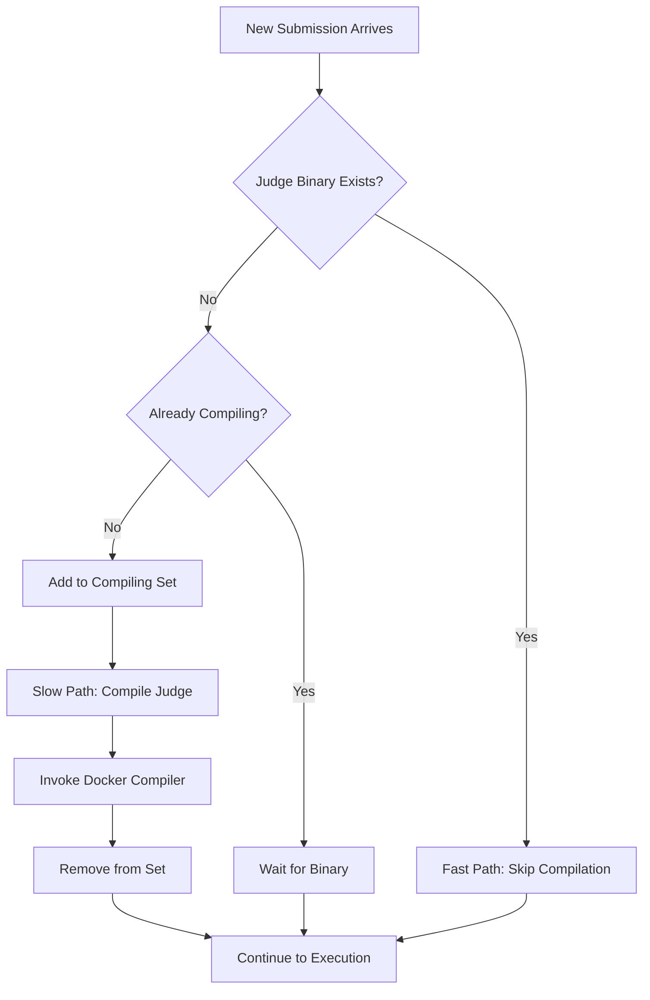

**Key Features:**

- **Lazy Compilation**: Judge binaries are compiled only on first submission for a question
- **Thread-Safe Locking**: Uses `ConcurrentHashMap.newKeySet()` to prevent duplicate compilations
- **Wait Mechanism**: Concurrent submissions wait for the first compilation to complete
- **Binary Caching**: Once compiled, the judge binary is reused for all future submissions

```java
// Thread-safe compilation tracking
private final Set<String> compilingQuestions = ConcurrentHashMap.newKeySet();

if (compilingQuestions.add(questionId)) {
    // First thread: compile the judge
    dockerExecutor.compileJudge(testcasesPath);
    compilingQuestions.remove(questionId);
} else {
    // Other threads: wait for binary to appear
    waitForJudgeBinary(judgeBinary);
}
```

---

### 4. Language Executors

Pluggable execution engines for different programming languages.

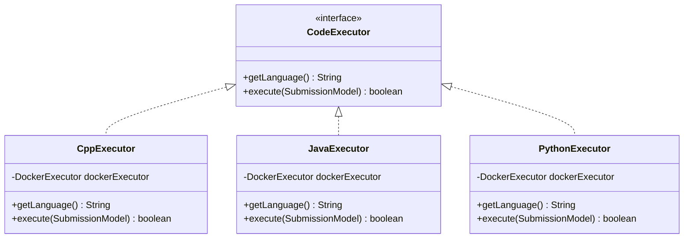

#### Execution Pipeline

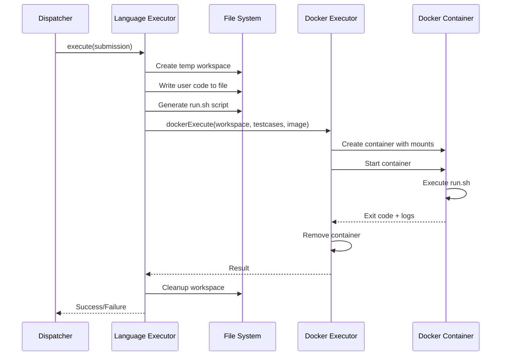

---

### 5. Docker Execution Environment

Secure, isolated containers for code execution.

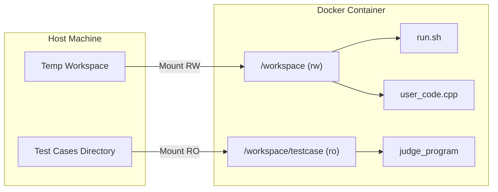

#### Container Images

| Image | Base | Purpose |
|-------|------|---------|
| `judge-cpp` | `debian:bookworm-slim` | C/C++ compilation and execution |
| `judge-java` | `eclipse-temurin:21-jdk` | Java compilation and execution |
| `judge-python` | `python:3.11-slim` | Python execution |

**Security Features:**

- Non-root user (`runner`) inside containers
- Read-only mount for test cases
- No network access (can be configured)
- Resource limits via `timeout` and `ulimit`

---

## Execution Script

The `run.sh` script orchestrates compilation, execution, and judging:

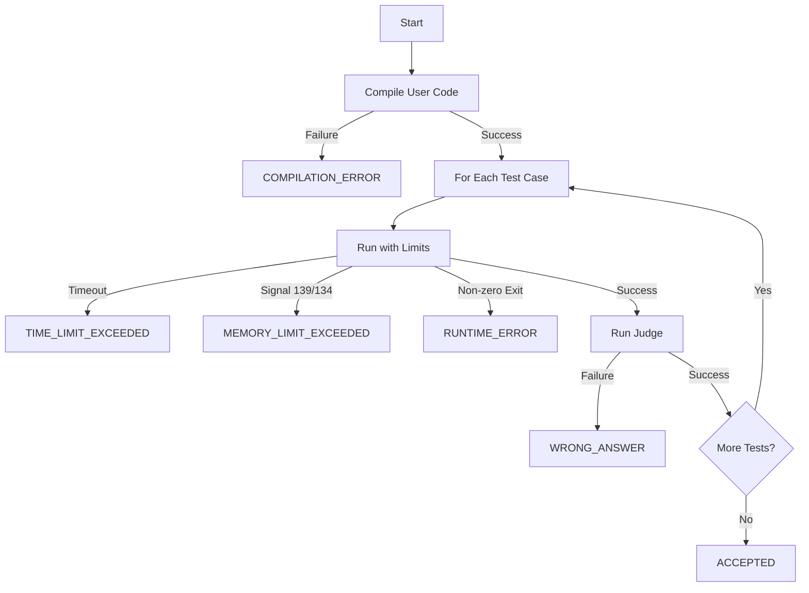

**Resource Enforcement:**

```bash
# Time limit via timeout command
timeout $TIME_LIMIT ./user_program < input.txt

# Memory limit via ulimit
ulimit -v $MEMORY_LIMIT
```

---

## Data Models

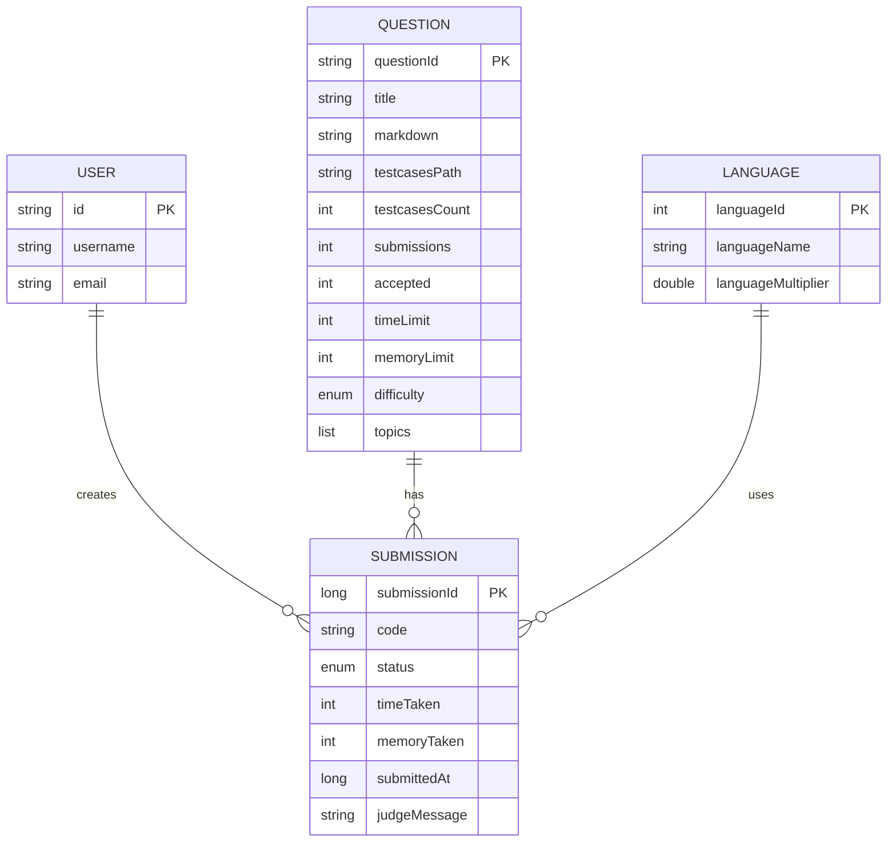

### Submission Status Values

| Status | Description |
|--------|-------------|
| `PENDING` | Awaiting processing |
| `RUNNING` | Currently executing |
| `ACCEPTED` | All test cases passed |
| `WRONG_ANSWER` | Output mismatch |
| `TLE` | Time Limit Exceeded |
| `MLE` | Memory Limit Exceeded |
| `RUNTIME_ERROR` | Crash during execution |
| `COMPILATION_ERROR` | Failed to compile |

---

## Custom Judge System

Each question can have a custom judge program for flexible output validation.

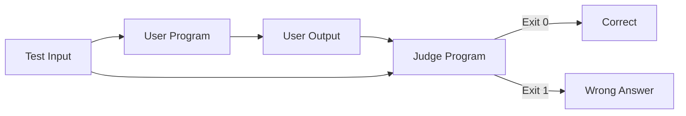

**Example Judge (C++):**

```cpp
#include <bits/stdc++.h>
using namespace std;

int main(int argc, char* argv[]) {
    string testcasePath = argv[1];
    ifstream testcase(testcasePath);
    
    string expected, userOutput;
    getline(testcase, expected);
    getline(cin, userOutput);
    
    return (expected == userOutput) ? 0 : 1;
}
```

This allows for:
- Floating-point tolerance comparisons
- Multiple valid answers
- Partial scoring
- Custom output formats

---

## Technology Stack

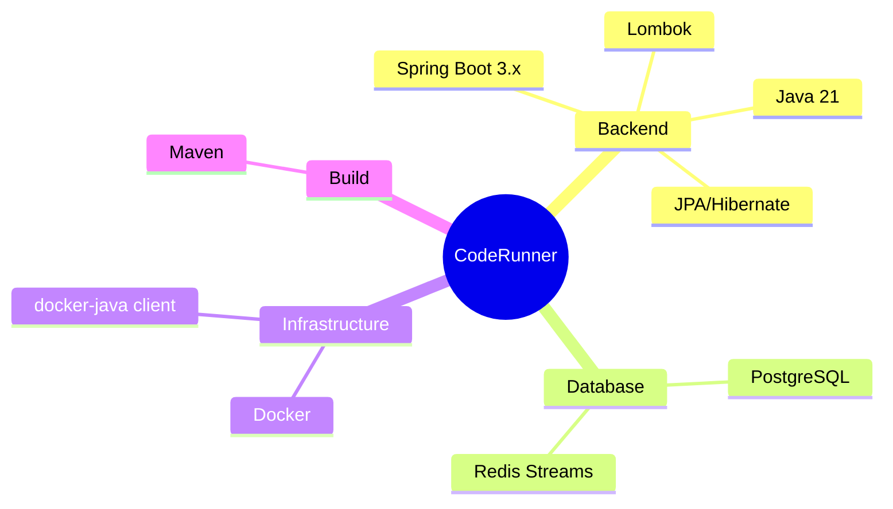

---

## Project Structure

```
coderunner/
├── coderunner-api/
│   └── src/main/java/com/varshith/coderunner/
│       ├── controllers/        # REST endpoints
│       │   ├── QuestionController.java
│       │   └── SubmissionController.java
│       ├── service/            # Business logic
│       │   ├── QuestionService.java
│       │   └── SubmissionService.java
│       ├── repository/         # Data access layer
│       ├── models/             # JPA entities
│       ├── dtos/               # Request/Response objects
│       ├── helpers/            # Validators, utilities
│       └── config/             # Redis, Database config
│
├── coderunner-workers/
│   └── src/main/java/com/varshith/coderunner_workers/
│       ├── consumer/           # Redis stream consumer
│       │   └── StreamConsumer.java
│       ├── dispatcher/         # Routing & bootstrapping
│       │   ├── SubmissionDispatcher.java
│       │   └── JudgeBootstrapCompiler.java
│       ├── executors/          # Language-specific execution
│       │   ├── CodeExecutor.java (interface)
│       │   ├── CppExecutor.java
│       │   └── DockerExecutor.java
│       ├── models/             # Shared JPA entities
│       └── config/             # Docker, Redis config
│
├── judge-images/               # Docker image definitions
│   ├── cpp/Dockerfile
│   ├── java/Dockerfile
│   └── python/Dockerfile
│
└── questions/                  # Test case storage
    └── {questionId}/
        └── testcases/
            ├── input/
            ├── judge.cpp
            └── judge_program (compiled)
```

---

## Configuration

### API Service (`application.properties`)

```properties
# Database
spring.datasource.url=jdbc:postgresql://localhost:5432/coderunner
spring.datasource.username=...
spring.datasource.password=...

# Test cases storage
spring.testcases.base_path=/path/to/questions/
```

### Worker Service (`application.properties`)

```properties
# Redis Stream
spring.stream.stream_name=submission-stream
spring.stream.consumer_name=coderunner-workers

# Concurrency
spring.execution.maximum-thread-count=5
```

---

## Extending the System

### Adding a New Language

1. **Create the Executor:**

```java
@Component
public class RustExecutor implements CodeExecutor {
    
    public String getLanguage() { 
        return "rust"; 
    }
    
    public boolean execute(SubmissionModel submission) {
        // Setup workspace, generate run.sh, invoke DockerExecutor
    }
}
```

2. **Create the Docker Image:**

```dockerfile
FROM rust:1.75-slim
WORKDIR /workspace
RUN useradd -m runner
USER runner
```

3. **Create the Run Script:**

```bash
#!/bin/bash
rustc user_code.rs -o user_program
# ... execution and judging logic
```

4. **Add to Database:**

```sql
INSERT INTO language_model (language_id, language_name, language_multiplier) 
VALUES (4, 'rust', 1.0);
```

---

## Scaling

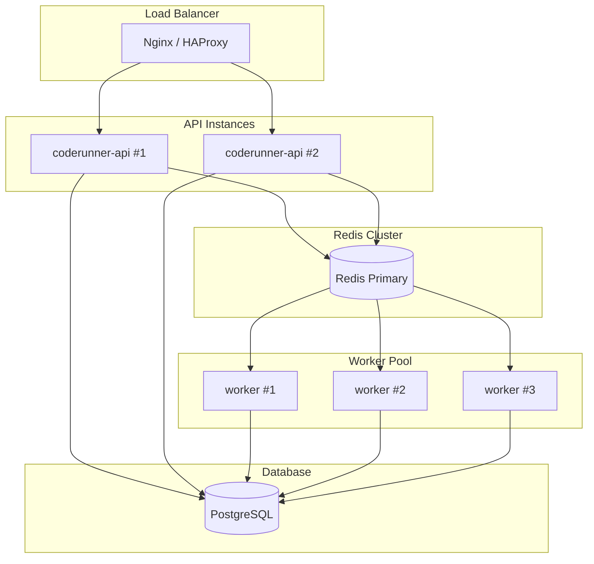

**Horizontal Scaling:**

- **API**: Stateless, can run multiple instances behind a load balancer
- **Workers**: Redis consumer groups automatically distribute messages across workers
- **Database**: Use read replicas for query-heavy operations

---

## License

MIT License - See [LICENSE](LICENSE) for details.
